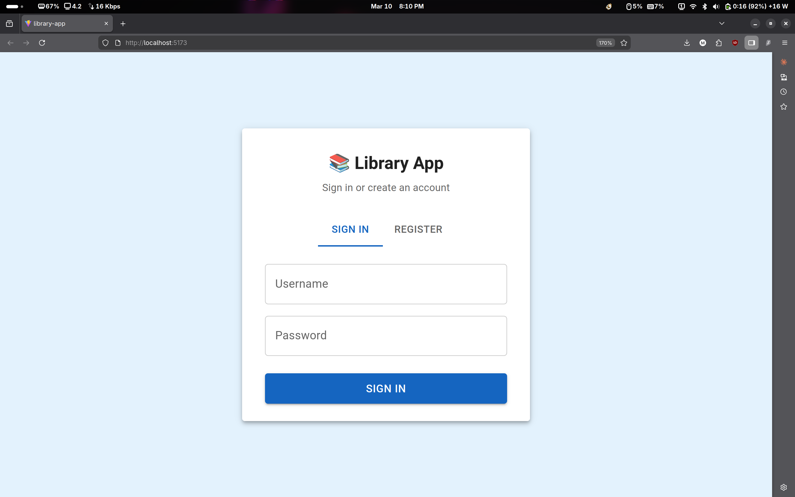
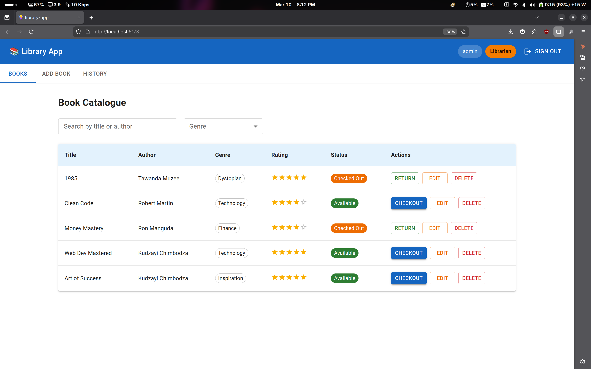
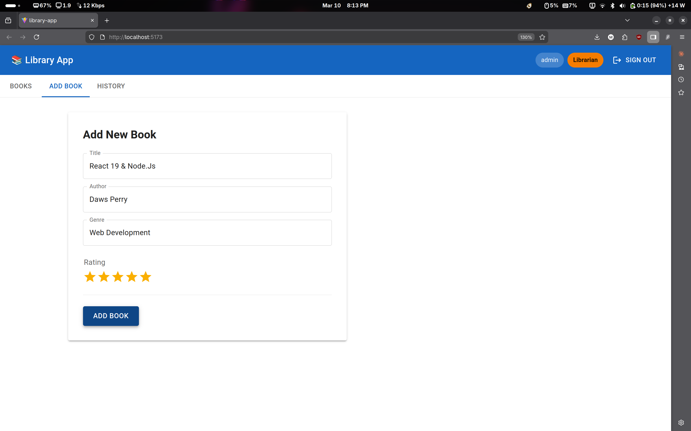
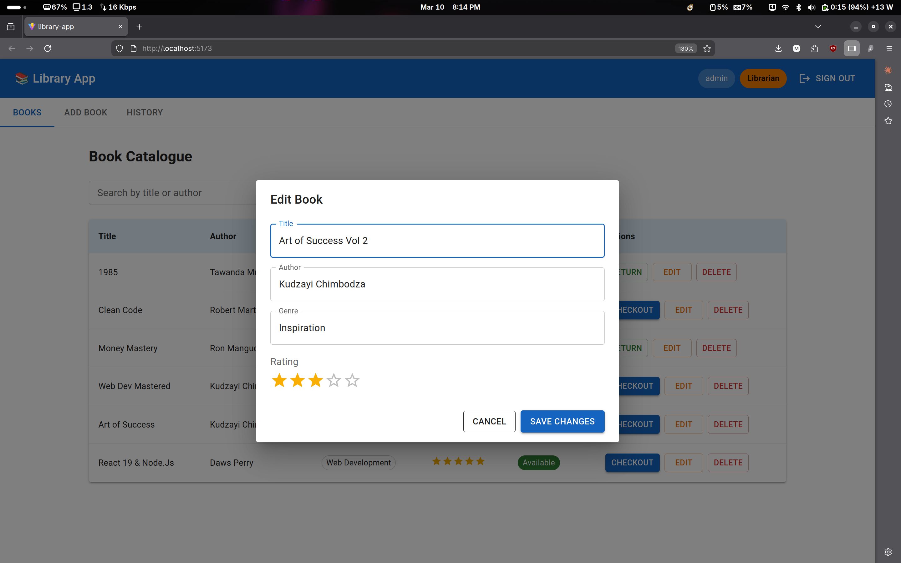
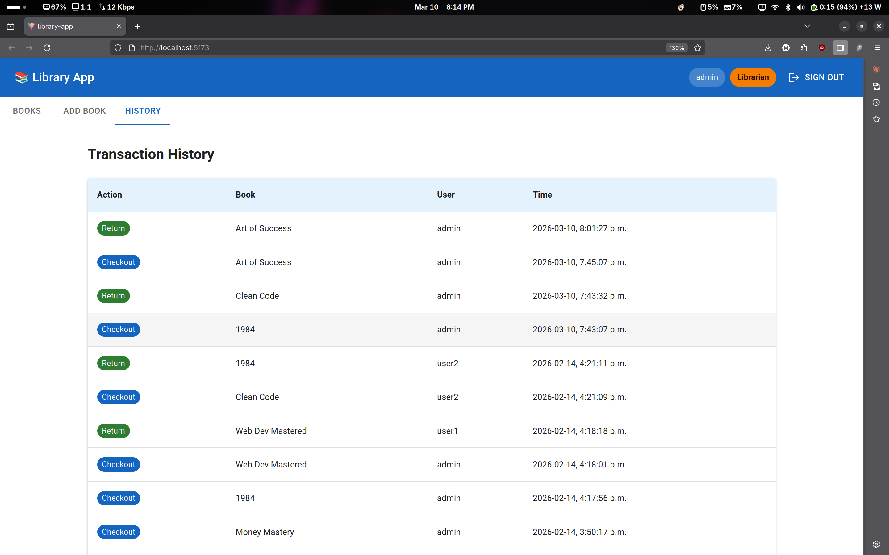

# Library App

A full-stack library management app built with React and Material UI, 
backed by a JSON Server REST API.

## Features
- Login and registration with role-based access (User / Librarian)
- Book catalogue with search and genre filter
- Checkout and return books
- Librarians can add, edit, and delete books
- Transaction history log
  
## Screenshots

*Login page*

*Book catalogue with search, genre filter, and role-based actions*

*Add book form — librarian only*

*Edit book dialog*

*Transaction history log*

## Tech Stack
React, Material UI (MUI), Vite, JSON Server

## Run Locally
npm install
npm install @mui/material @emotion/react @emotion/styled @mui/icons-material
json-server --watch db.json --port 3000
npm run dev
